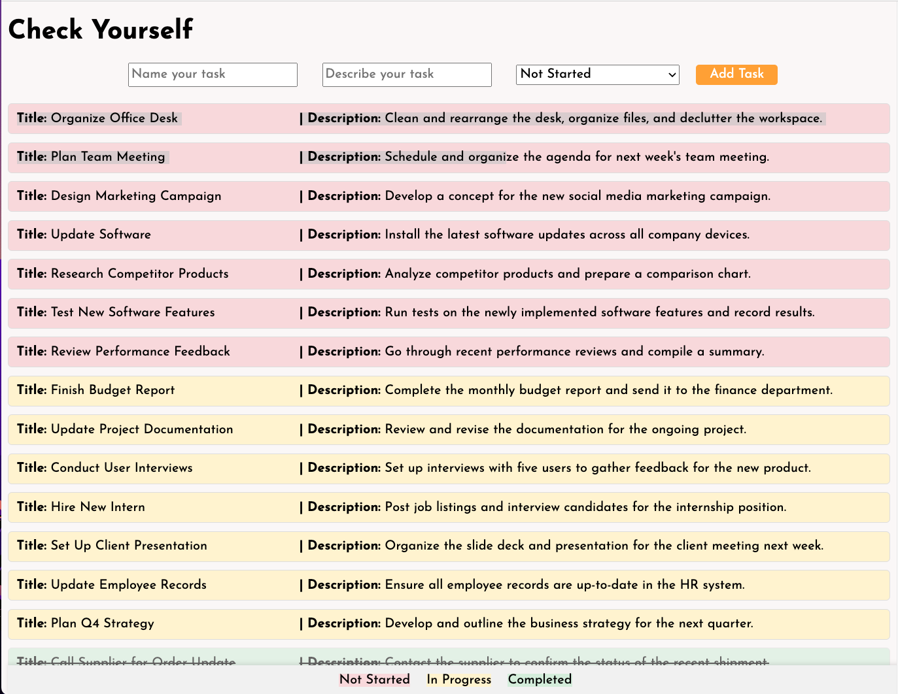

<div>
    <h1 align='center'> Check Yourself</h1>
    <p align='center'> Do you have habit of forgetting what you need to do? You can "check yourself" with this simple task list tool!</p>
    <p align='center'> Built with React (JS) and Flask (Python)</p>
    <p align='center'> https://checkyourself-eq9n.onrender.com </p>
</div>

## About the Project



- User is able to post their new task with options of "Not Started" or "In Progress"
- Application automatically sorts the items in order of "Not Started", "In Progress", and "Completed"
- Color-coded to make it fun and put less clutter on screen
- Edit and Delete options will pop up when user hovers over the task
- Check mark button provided for easy access to "Completed" without having to go to full edit


## Installation
To run this application on your local PC:

1. Fork the github repo
2. create .env file and input these lines of codes
   ```
    FLASK_APP=app.py
    FLASK_RUN_PORT=5555
   ```
3. Install the dependencies
    ```
    pipenv install
    npm install
    pipenv shell
   ```
4. To start backend,
   ```
    cd server
    python app.py
   ```

5. To start frontend,
   ```
    npm start
   ```